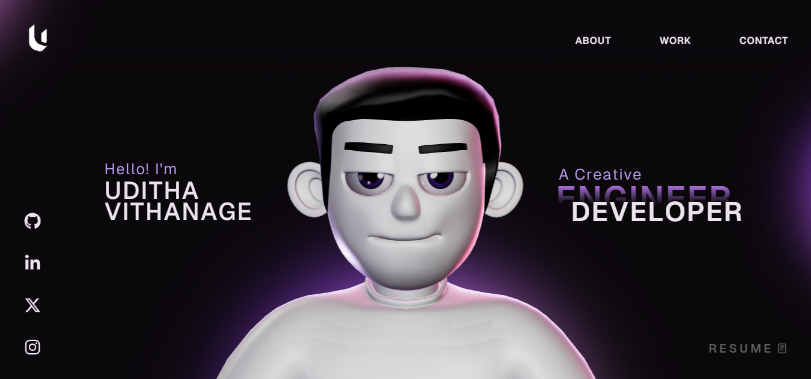

# 3D Portfolio Website

A modern, interactive portfolio website featuring 3D graphics and smooth animations built with React, Three.js, and GSAP.



## Overview

This portfolio website showcases a unique user experience by integrating 3D character models and environments with smooth scroll-based animations. The project leverages cutting-edge web technologies to create an immersive and engaging presentation of professional work and skills.

## Features

- **3D Character Integration**: Interactive 3D character model with custom animations
- **Smooth Scroll Animations**: GSAP-powered scroll-triggered animations for seamless transitions
- **Responsive Design**: Optimized for all device sizes and screen resolutions
- **Performance Optimized**: Efficient rendering and lazy loading for optimal performance
- **Modern Tech Stack**: Built with React, TypeScript, and Three.js
- **Custom Lighting**: HDR environment mapping for realistic lighting effects
- **Physics Integration**: React Three Rapier for realistic physics simulations

## Tech Stack

### Core Technologies

- **React 18.3.1**: Modern React with hooks and functional components
- **TypeScript 5.5.3**: Type-safe development
- **Vite 5.4.1**: Fast build tool and development server
- **Three.js 0.168.0**: 3D graphics library

### 3D Graphics

- **@react-three/fiber**: React renderer for Three.js
- **@react-three/drei**: Useful helpers for react-three-fiber
- **@react-three/rapier**: Physics engine integration
- **@react-three/postprocessing**: Post-processing effects

### Animation

- **GSAP 3.12.7**: Professional-grade animation library
- **@gsap/react**: GSAP React integration

### Additional Libraries

- **react-icons**: Icon library
- **react-fast-marquee**: Marquee component for scrolling text
- **@vercel/analytics**: Analytics integration

## Prerequisites

Before you begin, ensure you have the following installed:

- Node.js (version 16.x or higher)
- npm or yarn package manager

## Installation

1. Clone the repository:

```bash
git clone https://github.com/udithavithanage/3d-web.git
cd Portfolio-Website
```

2. Install dependencies:

```bash
npm install
```

## Development

Start the development server:

```bash
npm run dev
```

The application will be available at `http://localhost:5173` (or another port if 5173 is in use).

### Available Scripts

- `npm run dev`: Start development server with host access
- `npm run build`: Build for production
- `npm run lint`: Run ESLint for code quality checks
- `npm run preview`: Preview production build locally

## Project Structure

```
src/
├── components/          # React components
│   ├── Character/      # 3D character related components
│   │   ├── data/       # Animation and bone data
│   │   └── utils/      # Character utilities
│   ├── styles/         # Component-specific styles
│   └── utils/          # General utilities
├── App.tsx             # Main application component
└── main.tsx            # Application entry point

public/
├── images/             # Static images
└── models/             # 3D models and HDR environments
```

## Building for Production

Create an optimized production build:

```bash
npm run build
```

The built files will be in the `dist` directory and can be deployed to any static hosting service.

## Deployment

This project is optimized for deployment on:

- Vercel (recommended)
- Netlify
- GitHub Pages
- Any static hosting service

### Deploying to Vercel

```bash
npm install -g vercel
vercel
```

## Performance Considerations

- 3D models are optimized and compressed
- Lazy loading implemented for heavy assets
- Code splitting for optimal bundle sizes
- HDR environment maps cached efficiently

## Browser Support

- Chrome (latest)
- Firefox (latest)
- Safari (latest)
- Edge (latest)

Note: WebGL 2.0 support required for full functionality.

## Contributing

Contributions are welcome! Please feel free to submit a Pull Request.

## License

This project is licensed under the terms specified in the LICENSE file.
